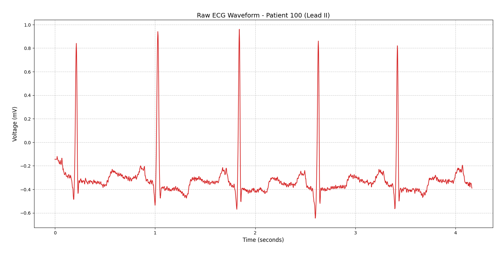
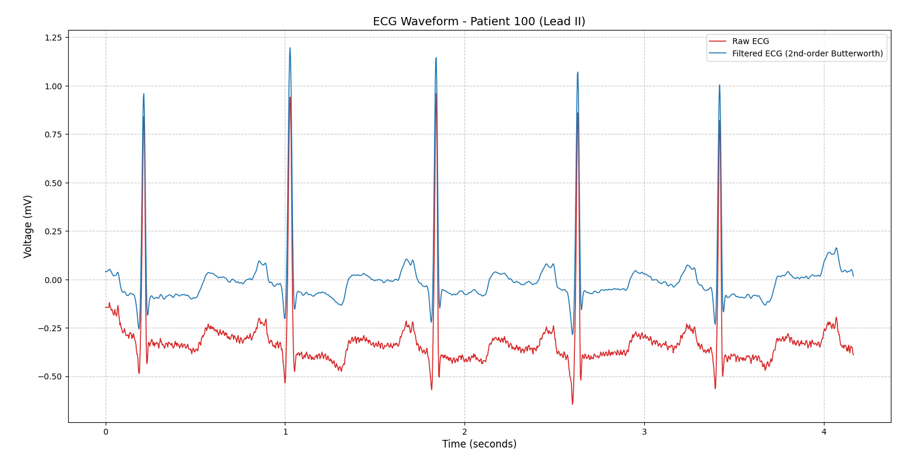

# ECG Signal Processor


A clinical-grade ECG digital signal processing pipeline featuring real-time streaming architecture, dual-stage Butterworth filtering, Pan-Tompkins QRS detection with dual adaptive thresholds, and RMSSD-based heart rate variability analysis — designed as a prospective early warning and detection system to flag cardiac abnormalities and assist practitioners before they become clinically apparent.

---

## Motivation

Cardiac events such as arrhythmias, autonomic dysfunction, and elevated stroke risk often produce detectable signatures in ECG morphology and heart rate variability **before** a patient is symptomatic. Current clinical workflows are largely reactive — a 12-lead ECG is reviewed after symptoms appear, not continuously monitored for subtle pattern drift.

This project addresses that gap. By combining rigorous DSP methodology with real-time streaming architecture and validated HRV analytics, the goal is a system that can:

- **Prospectively detect** arrhythmic and autonomic patterns from continuous ECG streams
- **Flag early warning indicators** — elevated RMSSD variability, irregular RR intervals, or anomalous QRS morphology — in real time
- **Present findings in plain language** to clinical staff without requiring DSP expertise to operate

The long-term vision is a tool deployable at the bedside or integrated with ambulatory ECG devices, capable of surfacing cardiac risk indicators before a clinical event occurs.

---

## Pipeline Architecture

```
Raw ECG Signal
      │
      ▼
┌─────────────────────┐
│  Data Ingestion      │  MIT-BIH / CSV / Serial / Network / Synthetic
└────────┬────────────┘
         │
         ▼
┌─────────────────────┐
│  Streaming Buffer    │  Sliding window: 3-sec chunks, 1-sec overlap
│  (StreamingBuffer)   │  Enables real-time processing without edge artifacts
└────────┬────────────┘
         │
         ▼
┌─────────────────────┐
│  DC Offset Removal   │  Centers signal at 0 mV before filtering
└────────┬────────────┘
         │
         ├──────────────────────────────────────┐
         ▼                                      ▼
┌─────────────────────┐             ┌───────────────────────┐
│  High-pass Filter    │             │   Display Filter       │
│  Butterworth 0.5 Hz  │             │   Butterworth 0.5–40Hz │
│  (baseline wander)   │             │   (full PQRST display) │
└────────┬────────────┘             └───────────────────────┘
         │
         ▼
┌─────────────────────┐
│  Bandpass Filter     │  Butterworth 5–15 Hz
│  (QRS isolation)     │  Pan-Tompkins recommended detection band
└────────┬────────────┘
         │
         ▼
┌─────────────────────┐
│  Pan-Tompkins QRS    │  Differentiation → Squaring → Moving-window
│  Detection           │  integration (150 ms) → Dual adaptive thresholds
│  (AdaptiveThreshold) │  → 250 ms refractory period → Searchback logic
└────────┬────────────┘
         │
         ▼
┌─────────────────────┐
│  Peak Deduplication  │  Global index conversion, cross-chunk suppression
└────────┬────────────┘
         │
         ▼
┌─────────────────────┐
│  HRV Analytics       │  RMSSD-based autonomic health quantification
│  (RMSSD)             │  Validated cardiac risk stratification marker
└────────┬────────────┘
         │
         ▼
   Output Metrics + Early Warning Flags
```

---

## Clinical Significance

### Why ECG Signal Processing Matters

Raw ECG signals are routinely degraded by noise before any clinical interpretation occurs:

- **Electromyographic (EMG) interference** from nearby muscle activity contaminates the signal baseline
- **Baseline wander** caused by respiratory movement shifts the isoelectric line, distorting ST-segment morphology
- **Powerline interference** (60 Hz in North America, 50 Hz internationally) can mask or mimic arrhythmic activity

Without rigorous filtering, automated rhythm analysis produces false positives and false negatives with direct patient safety implications. This pipeline is designed to reproduce the signal conditioning standards used in clinical-grade ECG devices.

### Heart Rate Variability as a Prospective Biomarker

HRV — specifically RMSSD (Root Mean Square of Successive Differences of RR intervals) — is a validated, non-invasive measure of autonomic nervous system function and cardiac risk:

| Metric | Clinical Interpretation |
|--------|------------------------|
| Low RMSSD | Reduced vagal tone; associated with increased risk of sudden cardiac death |
| Elevated RMSSD variability | May indicate autonomic instability or evolving arrhythmia |
| Irregular RR series | Primary diagnostic signature of atrial fibrillation — the leading cardioembolic stroke risk factor |

By computing RMSSD continuously in a streaming context, this system can surface autonomic deterioration **prospectively**, before the patient or clinician is aware of a change.

---

## The Physics

Standard ECG signals occupy a narrow physiological band:

- **Voltage:** 0.5 mV to 5 mV (must be preserved through amplification and filtering)
- **QRS energy band:** 5–40 Hz (Pan-Tompkins detection optimised at 5–15 Hz)
- **P/T wave energy:** <5 Hz (preserved by the display-band filter at 0.5–40 Hz)
- **Respiratory artifact:** <0.5 Hz (removed by high-pass filter)
- **Powerline noise:** 50/60 Hz (targeted by planned notch filter in Phase 2)

### Dual-Band Filter Design

The pipeline uses two parallel filter paths intentionally:

| Filter | Band | Purpose |
|--------|------|---------|
| High-pass Butterworth | 0.5 Hz | Baseline wander removal |
| Bandpass Butterworth | 5–15 Hz | QRS detection (Pan-Tompkins optimal) |
| Display Butterworth | 0.5–40 Hz | Full PQRST morphology for clinical visualisation |

The detection and display paths are deliberately separate. The 5–15 Hz detection filter maximises R-peak detection accuracy; the 0.5–40 Hz display filter ensures clinicians see a morphologically complete waveform — not the detection-optimised signal.

---

## Methodology

### 1. Data Ingestion

The pipeline uses the `wfdb` library to stream records from PhysioNet's MIT-BIH Arrhythmia Database — a gold-standard validated dataset of 48 half-hour ambulatory ECG recordings. It also supports live hardware inputs:

| Source | Description |
|--------|-------------|
| MIT-BIH / PhysioNet | Pre-recorded clinical ECG records via `wfdb` |
| CSV file | Any single-column or labelled ECG data file |
| Serial port | Live ECG sensor (e.g. Arduino + AD8232) |
| Network socket | Wireless or cloud-streamed ECG data |
| Synthetic | Simulated signal for development and testing |

### 2. Streaming Architecture

A `StreamingBuffer` class implements a sliding window buffer with configurable overlap:

- **Window:** 3-second chunks (1,080 samples at 360 Hz)
- **Overlap:** 1-second (360 samples), preventing edge artifacts at chunk boundaries
- **Stride:** 2 seconds per advance — ensures continuity across chunk transitions
- Each chunk is processed independently, with filter state preserved across boundaries via stateful SOS (second-order sections) filtering

This architecture enables real-time processing of continuous ECG streams from any source — including live patient monitors or ambulatory devices.

### 3. Signal Conditioning

A two-stage stateful Butterworth filter chain processes each chunk:

1. **DC offset removal** — subtracts the chunk mean to centre the signal at 0 mV
2. **High-pass at 0.5 Hz** — removes respiratory baseline wander
3. **Bandpass at 5–15 Hz** — isolates QRS complex energy for R-peak detection
4. **Display path at 0.5–40 Hz** — parallel filter preserving full waveform morphology

Filter state (`zi` — the second-order section delay state) is carried between chunks, ensuring no phase discontinuities at window boundaries — a critical requirement for streaming clinical applications.

### 4. QRS Detection — Pan-Tompkins Algorithm

A full implementation of the original Pan-Tompkins (1985) algorithm with dual adaptive thresholds:

1. **Differentiation** — emphasises the steep slope of the R-wave
2. **Squaring** — makes all values positive and amplifies large slopes nonlinearly
3. **Moving-window integration** — 150 ms window highlights QRS energy peaks
4. **Dual adaptive thresholds:**
   - `THRESHOLD1` — primary detection (higher threshold, fewer false positives)
   - `THRESHOLD2` — searchback detection (lower threshold, catches missed beats)
   - Both thresholds update continuously based on signal and noise level history from the last 8 detected peaks
5. **Refractory period** — 250 ms minimum between peaks prevents double-detection within a single beat
6. **Searchback logic** — if no peak is found within 1.5× the expected RR interval, the algorithm searches backward using `THRESHOLD2`, recovering missed beats without human intervention

### 5. Peak Deduplication

Detected peaks are converted from local chunk indices to global signal indices. Near-duplicate detections across overlapping windows (within ±3 samples) are suppressed, ensuring each R-peak is represented exactly once in the output.

### 6. HRV Analytics — RMSSD

RMSSD is computed from the global R-peak index array:

```
RR intervals (ms) = diff(R-peak times in ms)
Successive differences = diff(RR intervals)
RMSSD = sqrt(mean(successive_differences²))
```

RMSSD is a clinically validated, time-domain HRV metric with direct interpretive value for autonomic function and cardiac risk stratification. It is the primary HRV metric recommended by the Task Force of the European Society of Cardiology for short-term recordings.

---

## Results

### Raw Signal (Before Processing)

Patient record `100` from the MIT-BIH Arrhythmia Database. Signal converted to physical units (time in seconds, voltage in millivolts):



### Filtered Signal (After Processing)

The filtered signal (blue) is anchored to the isoelectric line with pronounced QRS complexes, setting the stage for accurate R-peak detection:



### Streaming Output (Live Processing)

Real-time display showing the filtered ECG with detected R-peaks (red dots), Pan-Tompkins integrator output, and chunk processing boundaries:


---

## Output Metrics

After processing, the pipeline reports:

- Total samples processed and recording duration
- Total R-peaks detected (post-deduplication)
- Average RR interval (ms) and estimated heart rate (bpm)
- **RMSSD (ms)** — HRV autonomic health indicator
- Adaptive threshold state per chunk: signal level, noise level, SNR ratio, peak amplitude history

---

## Development Roadmap

The long-term goal is software suitable for real patient care settings — presenting HRV and early warning indicators to clinical staff without requiring technical knowledge to operate.

### Phase 1 — Signal Quality *(In Progress)*

- [x] Dual-band filter pipeline (detection + display)
- [x] Streaming architecture with sliding window buffer
- [ ] **60/50 Hz notch filter** — powerline interference removal (critical for physical hardware)
- [ ] **Signal Quality Index (SQI)** — distinguish genuine flatline from lead-off artifact

### Phase 2 — Clinical Analytics

- **Full HRV suite:** Extend beyond RMSSD to include SDNN (overall variability), pNN50 (percentage of intervals >50 ms apart), and LF/HF frequency-domain ratio via FFT on the RR interval series
- **Arrhythmia detection:** Automatically identify AFib (irregular RR intervals, absent P waves), bradycardia, and tachycardia
- **Early warning system:** Continuously monitor HRV trend drift and RR interval irregularity as prospective indicators of deteriorating cardiac status
- **Stroke risk flagging:** AFib is the primary cardioembolic stroke risk factor detectable from ECG. Flagging AFib episodes with an embolic risk score is the clinically validated pathway toward automated stroke risk reporting

### Phase 3 — Usability *(Non-Technical Operators)*

- **GUI frontend:** Desktop or web-based application designed for clinical staff — large waveform display, clear metric readouts, and alert indicators requiring no DSP knowledge
- **Automatic device setup:** Plug-and-play serial/USB detection; no manual port or baud rate configuration
- **Clinical report export:** PDF summaries with waveform snapshots, HRV metrics, and plain-language findings suitable for inclusion in patient records

### Phase 4 — Clinical Compliance *(Regulatory)*

- **IEC 60601** medical electrical equipment safety certification
- **Alarm system** conforming to IEC 62133 alert thresholds for life-critical events
- **Data logging and audit trail** compliant with HIPAA, with HL7/FHIR format compatibility for EHR integration
- Regulatory approval pathway (FDA 510(k) clearance or CE marking) depending on deployment jurisdiction

---

## Installation

```bash
git clone https://github.com/Gyungeose/ECG-Signal-Processor.git
cd ECG-Signal-Processor
pip install -r requirements.txt
```

### Dependencies

```
wfdb
numpy
scipy
matplotlib
```

Optional (for live hardware streaming):

```bash
pip install pyserial   # Serial port / physical ECG sensor support
```

---

## Usage

```bash
python main.py
```

The pipeline prompts for a data source at startup:

```
ECG STREAMING DATA SOURCE SELECTOR
====================================
1. Synthetic  — simulated signal for testing
2. CSV File   — pre-recorded ECG data
3. Serial Port — live sensor connection (AD8232, Arduino, etc.)
4. Network    — wireless or cloud-streamed ECG
```

Source-specific configuration (port, file path, host) is handled interactively. A live plot is rendered automatically when a display is available.

---

## References

- Pan, J. & Tompkins, W.J. (1985). *A Real-Time QRS Detection Algorithm.* IEEE Transactions on Biomedical Engineering, 32(3), 230–236.
- Task Force of the European Society of Cardiology (1996). *Heart Rate Variability: Standards of Measurement, Physiological Interpretation, and Clinical Use.* Circulation, 93(5), 1043–1065.
- MIT-BIH Arrhythmia Database — PhysioNet: https://physionet.org/content/mitdb/
- Malik, M. (1996). *Heart Rate Variability.* Annals of Noninvasive Electrocardiology.

---

## License

MIT License — see [LICENSE](LICENSE) for details.
