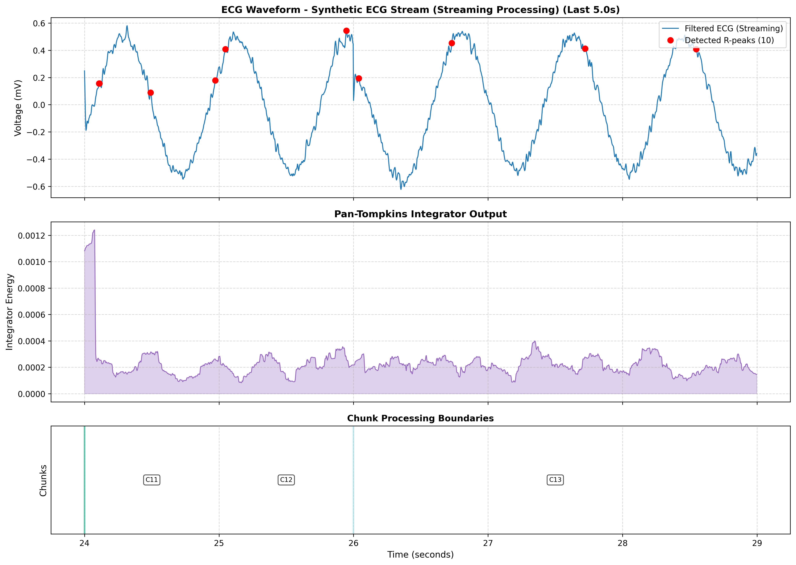

# ECG-Signal-Processor

HELLO! This project implements a digital signal processing (DSP) pipeline to analyze raw electrocardiogram (ECG) data. Using the MIT-BIH Arrhythmia Database, the software filters biological and environmental noise, detects QRS complexes, and calculates Heart Rate Variability (HRV) — a key metric for autonomic nervous system health.

---

## Clinical Significance

In clinical practice, raw ECG signals are often obscured by "noise" such as electromyographic (EMG) interference from muscle tremors or baseline wander from respiration.

* **The Goal:** To automate the transition from noisy raw data to clean, interpretable waveforms.
* **HRV Analysis:** By measuring the R-R interval variation, this tool provides insights into the risk of sudden cardiac death and autonomic dysfunction.

---

## The Physics

To process cardiac data, we must account for the following physical properties:

* **Voltage Dynamics:** Standard ECG signals range between **0.5 mV and 5 mV**. The software must maintain this scale during amplification and filtering.
* **Spectral Interference:** Environmental noise typically occurs at **60 Hz** (power lines in North America / 50 Hz internationally), while respiratory drift occurs at low frequencies (<0.5 Hz).
* **Digital Filtering — Two-Stage Design:**
  * A **high-pass Butterworth filter at 0.5 Hz** removes baseline wander while preserving all cardiac waveform components.
  * A **bandpass Butterworth filter at 5–15 Hz** isolates QRS complex energy for R-peak detection. This narrower band is intentional — it is the range recommended by the Pan-Tompkins algorithm for maximising detection accuracy. Note: the display pipeline uses a wider 0.5–40 Hz band to preserve full PQRST morphology for clinical visualisation.

---

## Methodology

The processing pipeline follows these engineering steps:

1. **Data Ingestion:** Utilizing the `wfdb` library to stream patient records from PhysioNet (MIT-BIH Arrhythmia Database). The pipeline also supports CSV files, serial port devices, network sockets, and a synthetic signal generator for testing — making it compatible with real ECG hardware.

2. **Streaming Architecture:** A sliding window buffer (`StreamingBuffer`) processes data in overlapping chunks (3-second windows with 1-second overlap), enabling real-time processing of continuous signal streams without edge artifacts at chunk boundaries.

3. **Signal Conditioning:** A two-stage stateful Butterworth filter chain:
   * High-pass at 0.5 Hz — removes baseline wander from respiration.
   * Bandpass at 5–15 Hz — isolates the steep slope of the QRS complex for detection.
   * DC offset removal is applied before filtering to centre the signal at 0 mV.

4. **QRS Detection — Pan-Tompkins Algorithm:** A full implementation of the Pan-Tompkins dual adaptive threshold method:
   * Differentiation to emphasise steep R-wave slopes.
   * Squaring to make all values positive and amplify large slopes.
   * Moving-window integration (150 ms window) to highlight QRS energy peaks.
   * Dual adaptive thresholds (THRESHOLD1 for primary detection, THRESHOLD2 for searchback) that continuously update based on signal and noise level history.
   * A refractory period of 250 ms prevents double-detection within a single beat.

5. **Deduplication:** Detected peaks are converted from local chunk indices to global signal indices, and near-duplicate detections across overlapping windows are suppressed.

6. **Analytics:** Calculation of the **Root Mean Square of Successive Differences (RMSSD)** to quantify HRV. RMSSD is a validated clinical marker for autonomic nervous system health and cardiac risk stratification.

---

## Data Sources Supported

| Source | Description |
|---|---|
| MIT-BIH / PhysioNet | Pre-recorded clinical ECG records via `wfdb` |
| CSV file | Any single-column or labelled ECG data file |
| Serial port | Live connection to a physical ECG sensor (e.g. Arduino, AD8232) |
| Network socket | Wireless or cloud-streamed ECG data |
| Synthetic | Simulated signal for testing and development |

---

## Results

### Raw Signal (Before Processing)

Connected to the MIT-BIH Arrhythmia Database using patient record `100` as a test case. The raw signal is converted to physical units (time in seconds, voltage in millivolts):


### Filtered Signal (After Processing)

The filtered signal (blue) is successfully anchored to the isoelectric line and QRS complexes are highly pronounced, setting the stage for accurate R-peak detection:


### Streaming Output (Live Processing)

The pipeline processes data in real time, displaying the filtered ECG with detected R-peaks (red dots), the Pan-Tompkins integrator output, and chunk processing boundaries:



---

## Output Metrics

After processing, the pipeline reports:

* Total samples and recording duration
* Total R-peaks detected (with deduplication)
* Average RR interval (ms)
* Estimated heart rate (bpm)
* RMSSD (ms)
* Adaptive threshold state: signal level, noise level, SNR ratio, and peak amplitude history

---

## Development Roadmap

The long-term goal of this project is to produce software usable with real ECG machines in patient care settings — presenting HRV and stroke risk indicators to clinical staff without requiring technical knowledge to operate.

### Phase 1 — Signal Quality (Immediate)

* Add a **display-band filter (0.5–40 Hz)** running in parallel with the detection filter, so the visualisation shows full PQRST morphology rather than the detection-optimised waveform.
* Add a **60/50 Hz notch filter** to remove powerline interference, which is critical when using physical ECG hardware.
* Implement a **Signal Quality Index (SQI)** to distinguish between genuine flatline and lead-off / electrode artifact — essential for safe clinical use.

### Phase 2 — Clinical Analytics

* **Full HRV suite:** Extend beyond RMSSD to include SDNN (overall variability), pNN50 (percentage of intervals >50 ms apart), and LF/HF frequency-domain ratio via FFT on the RR interval series.
* **Arrhythmia detection:** Identify AFib (irregular RR intervals, absent P waves), bradycardia, and tachycardia automatically.
* **Stroke risk indicators:** AFib is the primary cardioembolic stroke risk factor detectable from ECG. Flagging AFib episodes with an embolic risk score is the clinically validated pathway toward stroke risk reporting.

### Phase 3 — Usability (Non-Technical Operators)

* **GUI frontend:** Replace the terminal interface with a desktop application (PyQt6 or web-based) designed for clinical staff — large waveform display, clear metric readouts, and alert indicators.
* **Automatic device setup:** Plug-and-play serial/USB detection so operators do not need to configure ports or baud rates manually.
* **Clinical report export:** Generate PDF summaries with waveform snapshots, HRV metrics, and plain-language findings suitable for inclusion in patient records.

### Phase 4 — Clinical Compliance (Regulatory)

* **IEC 60601** medical electrical equipment safety certification.
* **Alarm system** conforming to IEC 62133 alert thresholds for life-critical events.
* **Data logging and audit trail** compliant with HIPAA, and HL7/FHIR format compatibility for electronic health record (EHR) integration.
* Regulatory approval pathway (FDA 510(k) clearance or CE marking) depending on deployment jurisdiction.

---

## Dependencies

```
wfdb
numpy
scipy
matplotlib
```

Install with:

```bash
pip install wfdb numpy scipy matplotlib
```

Optional (for hardware streaming):

```bash
pip install pyserial   # Serial port support
```

---

## References

* Pan, J. & Tompkins, W.J. (1985). *A Real-Time QRS Detection Algorithm.* IEEE Transactions on Biomedical Engineering, 32(3), 230–236.
* MIT-BIH Arrhythmia Database — PhysioNet: https://physionet.org/content/mitdb/
* Malik, M. (1996). *Heart Rate Variability.* Annals of Noninvasive Electrocardiology.
